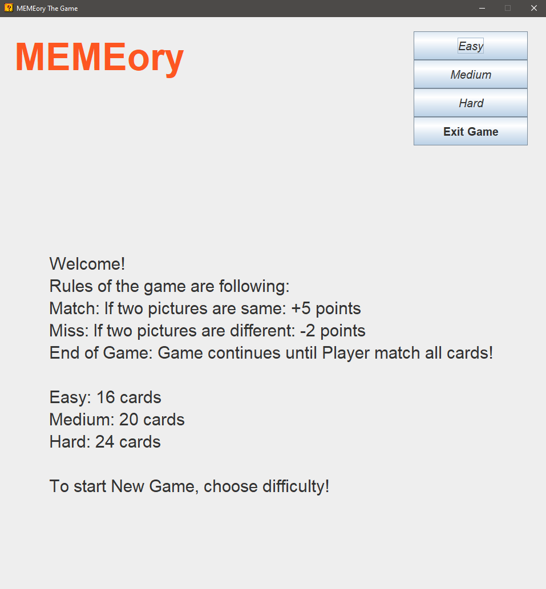
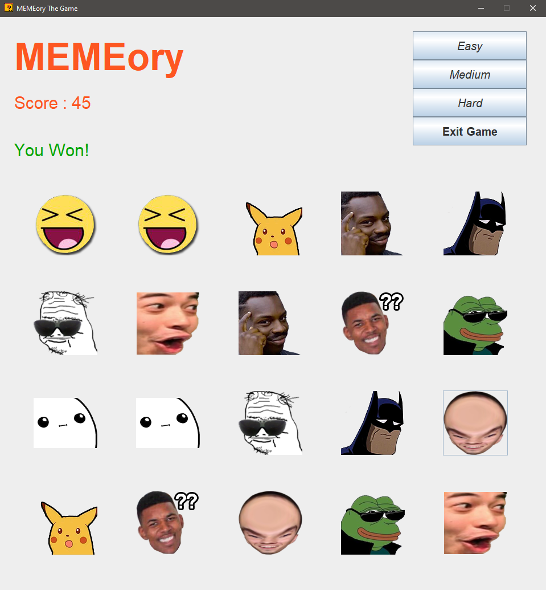

# Memory-Game
### Memory game created in Java Swing as final project for Oriented Programming in Java on II SEM PJAIT

##Menu

## Medium difficulty

## Game won on medium

## Game lost on easy

## Scoreboard saved in .txt

